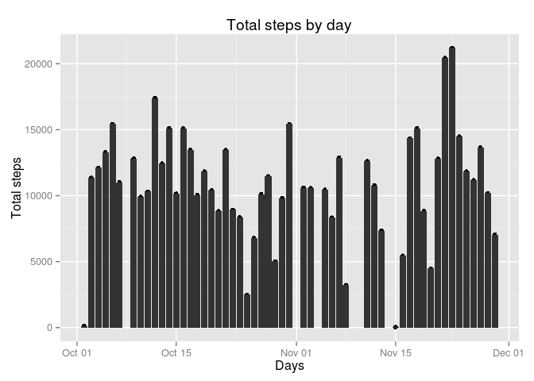
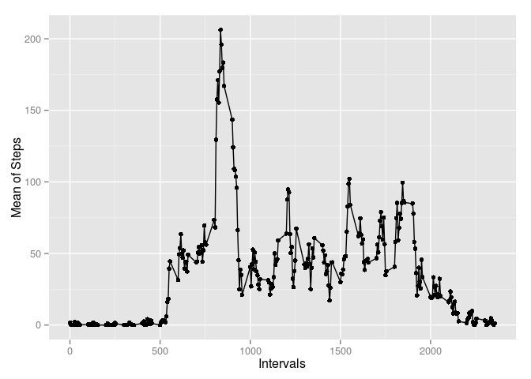
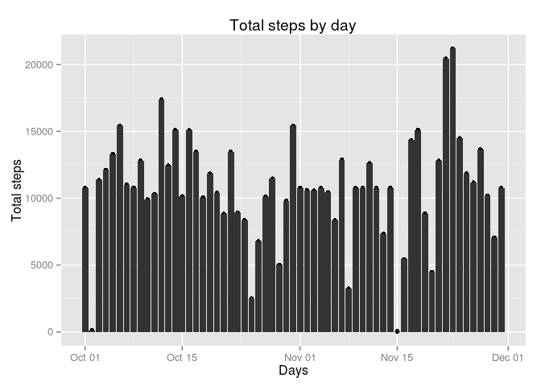
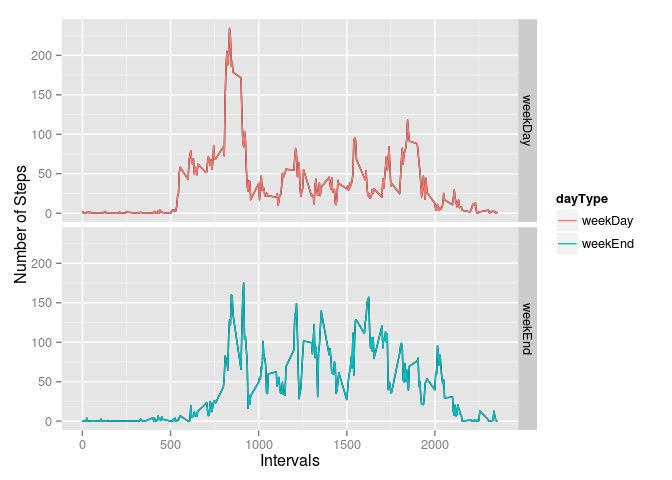

# Reproducible Research: Peer Assessment 1

*17 September 2015 , by Stefano E. Campanini*

## Load required libs

```r
library(ggplot2)
library(knitr)
```

## Loading and preprocessing the data
Data is loaded directly from zip file, it contains the csv file

```r
activityRawData <- read.csv(unz("activity.zip", "activity.csv"), sep = ",", stringsAsFactors = FALSE )
```

The preprocessing of the data is about, removing observations with missing values and transform dates from string to date type

```r
activityData <-  na.omit(activityRawData)
activityData$date <- as.Date(activityData$date) 
```

## What is mean total number of steps taken per day?
The procedure to find the total number of steps per day is about the aggregation by date and some change to column names. Here there is also the calculation of the mean by day and the Median by day 

```r
activityByDayCount <- aggregate(activityData$steps, by=list(date=activityData$date), FUN=sum)
names(activityByDayCount)[names(activityByDayCount) == 'x'] <- 'sum'

activityByDayMedian <- aggregate(activityData$steps, by=list(date=activityData$date), FUN=median)
names(activityByDayMedian)[names(activityByDayMedian) == 'x'] <- 'median'

activityByDayMean <- aggregate(activityData$steps, by=list(date=activityData$date), FUN=mean)
names(activityByDayMean)[names(activityByDayMean) == 'x'] <- 'mean'
```

### Here the histogram of the **total** steps by day
Keep in mind that days with observations containing NA values are been dropped.

```r
histTotalSteps <- qplot(date,sum, data=activityByDayCount)  + geom_histogram(stat="identity", binwidth=.5)  + labs(x = "Days", y = "Total steps", title = "Total steps by day")
print(histTotalSteps)
```

 

### Here the table of the **mean** of the steps by day

```r
kable(activityByDayMean, digits=2, caption="Steps mean and day")
```


Table: Steps mean and day

date           mean
-----------  ------
2012-10-02     0.44
2012-10-03    39.42
2012-10-04    42.07
2012-10-05    46.16
2012-10-06    53.54
2012-10-07    38.25
2012-10-09    44.48
2012-10-10    34.38
2012-10-11    35.78
2012-10-12    60.35
2012-10-13    43.15
2012-10-14    52.42
2012-10-15    35.20
2012-10-16    52.38
2012-10-17    46.71
2012-10-18    34.92
2012-10-19    41.07
2012-10-20    36.09
2012-10-21    30.63
2012-10-22    46.74
2012-10-23    30.97
2012-10-24    29.01
2012-10-25     8.65
2012-10-26    23.53
2012-10-27    35.14
2012-10-28    39.78
2012-10-29    17.42
2012-10-30    34.09
2012-10-31    53.52
2012-11-02    36.81
2012-11-03    36.70
2012-11-05    36.25
2012-11-06    28.94
2012-11-07    44.73
2012-11-08    11.18
2012-11-11    43.78
2012-11-12    37.38
2012-11-13    25.47
2012-11-15     0.14
2012-11-16    18.89
2012-11-17    49.79
2012-11-18    52.47
2012-11-19    30.70
2012-11-20    15.53
2012-11-21    44.40
2012-11-22    70.93
2012-11-23    73.59
2012-11-24    50.27
2012-11-25    41.09
2012-11-26    38.76
2012-11-27    47.38
2012-11-28    35.36
2012-11-29    24.47

### Here the table of the **median** of the steps by day

```r
kable(activityByDayMedian, digits=2, caption="Steps median and day") 
```


Table: Steps median and day

date          median
-----------  -------
2012-10-02         0
2012-10-03         0
2012-10-04         0
2012-10-05         0
2012-10-06         0
2012-10-07         0
2012-10-09         0
2012-10-10         0
2012-10-11         0
2012-10-12         0
2012-10-13         0
2012-10-14         0
2012-10-15         0
2012-10-16         0
2012-10-17         0
2012-10-18         0
2012-10-19         0
2012-10-20         0
2012-10-21         0
2012-10-22         0
2012-10-23         0
2012-10-24         0
2012-10-25         0
2012-10-26         0
2012-10-27         0
2012-10-28         0
2012-10-29         0
2012-10-30         0
2012-10-31         0
2012-11-02         0
2012-11-03         0
2012-11-05         0
2012-11-06         0
2012-11-07         0
2012-11-08         0
2012-11-11         0
2012-11-12         0
2012-11-13         0
2012-11-15         0
2012-11-16         0
2012-11-17         0
2012-11-18         0
2012-11-19         0
2012-11-20         0
2012-11-21         0
2012-11-22         0
2012-11-23         0
2012-11-24         0
2012-11-25         0
2012-11-26         0
2012-11-27         0
2012-11-28         0
2012-11-29         0


## What is the average daily activity pattern?
Here the graph of the steps mean by interval. Days with observations containing NA values are been dropped. Also there is the calculation of the value of the max of the day means.

```r
activityByIntervalMean <- aggregate(activityData$steps, by=list(interval=activityData$interval), FUN=mean, na.rm=TRUE)
names(activityByIntervalMean)[names(activityByIntervalMean) == 'x'] <- 'mean'
qplot(interval, mean, data=activityByIntervalMean)  + labs(x = "Intervals", y = "Mean of Steps")  + geom_line()
```

 
Also there is the calculation of the value of the max value of the day means.

```r
maxStepInterval = activityByIntervalMean[which(activityByIntervalMean$mean == max(activityByIntervalMean$mean)), ]
```
**The day mean max steps fond is located at interval 835**

## Imputing missing values
Finding the missing values using colSums function

```r
missingValues <- colSums(is.na(activityRawData))
```
**The the total number of rows with NAs) is : 2304**

### NA fill strategy
The Missing value strategy adopted is to sobstitute NA values with the global mean of steps, here how it has been implemented

```r
activityDataNAFilled <- activityRawData
globalMean <-  mean(activityData$steps)
index <- which(is.na(activityDataNAFilled$steps)==TRUE)         # get index of NA values 
activityDataNAFilled[index, "steps"] <- globalMean               
activityDataNAFilled$date <- as.Date(activityDataNAFilled$date) 
```

### Here the histogram of the **total** of the steps by day, with filled NA values, 
Here preprocessing and the plot of the histogram of the total steps by day, with filled NA values

```r
activityDataNAFilledByDayCount <- aggregate(activityDataNAFilled$steps, by=list(date=activityDataNAFilled$date), FUN=sum)
names(activityDataNAFilledByDayCount)[names(activityDataNAFilledByDayCount) == 'x'] <- 'sum'
histTotalNAFilledSteps <- qplot(date,sum, data=activityDataNAFilledByDayCount)  + geom_histogram(stat="identity", binwidth=.5)  + labs(x = "Days", y = "Total steps", title = "Total steps by day")
print(histTotalNAFilledSteps)
```

 

### Here the table of the **mean** of the steps by day, with filled NA values, 
There is some preprocessing aggregating and renaming 

```r
activityDataNAFilledByDayMean <- aggregate(activityDataNAFilled$steps, by=list(date=activityDataNAFilled$date), FUN=mean)
names(activityDataNAFilledByDayMean)[names(activityDataNAFilledByDayMean) == 'x'] <- 'mean'
```


```r
kable(activityDataNAFilledByDayMean, digits=2, caption="Steps mean and day, for filled NA values dataset") 
```


Table: Steps mean and day, for filled NA values dataset

date           mean
-----------  ------
2012-10-01    37.38
2012-10-02     0.44
2012-10-03    39.42
2012-10-04    42.07
2012-10-05    46.16
2012-10-06    53.54
2012-10-07    38.25
2012-10-08    37.38
2012-10-09    44.48
2012-10-10    34.38
2012-10-11    35.78
2012-10-12    60.35
2012-10-13    43.15
2012-10-14    52.42
2012-10-15    35.20
2012-10-16    52.38
2012-10-17    46.71
2012-10-18    34.92
2012-10-19    41.07
2012-10-20    36.09
2012-10-21    30.63
2012-10-22    46.74
2012-10-23    30.97
2012-10-24    29.01
2012-10-25     8.65
2012-10-26    23.53
2012-10-27    35.14
2012-10-28    39.78
2012-10-29    17.42
2012-10-30    34.09
2012-10-31    53.52
2012-11-01    37.38
2012-11-02    36.81
2012-11-03    36.70
2012-11-04    37.38
2012-11-05    36.25
2012-11-06    28.94
2012-11-07    44.73
2012-11-08    11.18
2012-11-09    37.38
2012-11-10    37.38
2012-11-11    43.78
2012-11-12    37.38
2012-11-13    25.47
2012-11-14    37.38
2012-11-15     0.14
2012-11-16    18.89
2012-11-17    49.79
2012-11-18    52.47
2012-11-19    30.70
2012-11-20    15.53
2012-11-21    44.40
2012-11-22    70.93
2012-11-23    73.59
2012-11-24    50.27
2012-11-25    41.09
2012-11-26    38.76
2012-11-27    47.38
2012-11-28    35.36
2012-11-29    24.47
2012-11-30    37.38

### Here the table of the **median** of the steps by day, with filled NA values
There is a preprocessing phase, as done before, aggregating and renaming the "mean" column

```r
activityDataNAFilledByDayMedian <- aggregate(activityDataNAFilled$steps, by=list(date=activityDataNAFilled$date), FUN=median)
names(activityDataNAFilledByDayMedian)[names(activityDataNAFilledByDayMedian) == 'x'] <- 'median'
```


```r
kable(activityDataNAFilledByDayMedian, digits=2, caption="Steps median and day, for filled NA values dataset")  
```


Table: Steps median and day, for filled NA values dataset

date          median
-----------  -------
2012-10-01     37.38
2012-10-02      0.00
2012-10-03      0.00
2012-10-04      0.00
2012-10-05      0.00
2012-10-06      0.00
2012-10-07      0.00
2012-10-08     37.38
2012-10-09      0.00
2012-10-10      0.00
2012-10-11      0.00
2012-10-12      0.00
2012-10-13      0.00
2012-10-14      0.00
2012-10-15      0.00
2012-10-16      0.00
2012-10-17      0.00
2012-10-18      0.00
2012-10-19      0.00
2012-10-20      0.00
2012-10-21      0.00
2012-10-22      0.00
2012-10-23      0.00
2012-10-24      0.00
2012-10-25      0.00
2012-10-26      0.00
2012-10-27      0.00
2012-10-28      0.00
2012-10-29      0.00
2012-10-30      0.00
2012-10-31      0.00
2012-11-01     37.38
2012-11-02      0.00
2012-11-03      0.00
2012-11-04     37.38
2012-11-05      0.00
2012-11-06      0.00
2012-11-07      0.00
2012-11-08      0.00
2012-11-09     37.38
2012-11-10     37.38
2012-11-11      0.00
2012-11-12      0.00
2012-11-13      0.00
2012-11-14     37.38
2012-11-15      0.00
2012-11-16      0.00
2012-11-17      0.00
2012-11-18      0.00
2012-11-19      0.00
2012-11-20      0.00
2012-11-21      0.00
2012-11-22      0.00
2012-11-23      0.00
2012-11-24      0.00
2012-11-25      0.00
2012-11-26      0.00
2012-11-27      0.00
2012-11-28      0.00
2012-11-29      0.00
2012-11-30     37.38

### Do these values differ from the estimates from the first part of the assignment? What is the impact of imputing missing data on the estimates of the total daily number of steps?

Due to the fact that in the first part of this analysis the days with NA values are been dropped or NA step values cover entire days, we cannot compare the mean, median and the total count , because there are no results for the days with NA values.
Here there is a test, and we see that no one difference is found.


```r
mergedCount <- merge(activityByDayCount, activityDataNAFilledByDayCount, by="date", all = FALSE)
indexCount <- which((mergedCount$sum.x - mergedCount$sum.y) != 0)  

mergedMean <- merge(activityByDayMean, activityDataNAFilledByDayMean, by="date", all = FALSE)
indexMean <- which((mergedMean$mean.x - mergedMean$mean.y) != 0)  

mergedMedian <- merge(activityByDayMedian, activityDataNAFilledByDayMedian, by="date", all = FALSE)
indexMedian <- which((mergedMedian$median.x - mergedMedian$median.y) != 0)  
```
The the days with a total steps by day changed is : 
The the days with a mean by day changed is : 
The the days with a median steps by day changed is : 

Obviously,  some difference can be found for stats on global values or stats calculated on aggregation by interval .

## Are there differences in activity patterns between weekdays and weekends?
Here there is a preprocessing, preparing the data to be plotted. It is added a column that indicate if the day of the observation is a *weekDay* or a *weekEndDay* . Days with observations containing NA values are been dropped.

```r
activityData$dayType <- ifelse((format(activityData$date, "%a") %in% c("Sun", "Sat")), "weekEnd","weekDay")
activityDataByIntervalMean <- aggregate(activityData$steps, by=list(interval=activityData$interval, dayType = activityData$dayType), FUN=mean, na.rm=TRUE)
names(activityDataByIntervalMean)[names(activityDataByIntervalMean) == 'x'] <- 'mean'

ggplot(activityDataByIntervalMean, aes(x=interval, y=mean)) + geom_line() + geom_line(aes(interval, mean, colour = dayType)) + facet_grid( dayType ~ .) + labs(x = "Intervals", y = "Number of Steps")
```

 

### Conclusions about activity patterns between weekdays and weekends

As you can see there are some differences:

- in the weekend days more steps are done in the morning. Maybe in the week days people cannot walk/run in the morning because they have to work
- in the weekend less steps are done in the evening, but more in the middle of the day. Maybe people like to run in the lunch break and after the work       
   
      
         
         
_  


